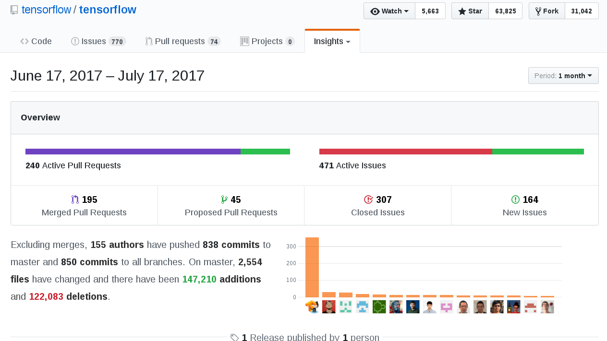

```{r setup, include=FALSE}
knitr::opts_chunk$set(echo = TRUE)
```

```{r}
library(dplyr)
library(ggplot2)
library(readr)
library(reshape2)
library(zoo)
```

# Data Collection

## Commit History via Git Log

```{r}
# TODO check for tensorflow directory, if none create via git clone, otherwise git pull to update
tf_path <- "tensorflow"

# TODO get latest SHA, save outfile as datetimestamp_SHA_tf_gitlog.txt
tf_outfile <- ''
system('cd tensorflow; git log --date=short --pretty=tformat:"%ad|%an" > ../data/tensorflow_gitlog.txt')
```

```{r}
tf_raw <- read.csv("data/tensorflow_gitlog.txt", header = FALSE, sep = "|", quote="",
                     col.names=c("git_log_date", "author"))

tf_parsed <- tf_raw %>% 
  mutate(commit_date=as.Date(git_log_date),
         commit_month=as.yearmon(commit_date)) %>% 
  select(commit_date, commit_month, author)
```

## Summarize by Month

```{r}
tf_commits_by_author <- tf_parsed %>% group_by(commit_month, author) %>% summarise(num_author_commits=n())

tf_authors <- tf_commits_by_author %>% group_by(commit_month) %>% 
  summarise(num_authors=n(), num_authors_adj=num_authors-(num_authors*.22))
tf_commits_by_month <- tf_parsed %>% group_by(commit_month) %>% 
  summarise(num_commits=n())
tf_authors_commits = merge(tf_authors, tf_commits_by_month, by=c("commit_month"))

tf_commits_by_author <- merge(tf_commits_by_author, tf_commits_by_month, by=c("commit_month"))
tf_commits_by_author <- tf_commits_by_author %>% 
  mutate(commits_pct = round(num_author_commits/num_commits, 2))
```

# Analysis

## Unique Authors Total

```{r}
tf_authors_total <- tf_parsed %>% group_by(author) %>% summarise(num_total_commits=n())
total_authors <- nrow(tf_authors_total)
total_authors
round(total_authors - (total_authors * .068))
```


## Unique Authors per Month

```{r}
ggplot(data = tf_authors_commits, aes(x = factor(commit_month), y = num_authors)) +
  geom_bar(stat="identity") +
  ylab("Commit Authors") +
  xlab("Month") +
  theme(axis.text.x = element_text(angle = 90, hjust = 1))

ggplot(data = tf_authors_commits, aes(x = factor(commit_month), y = num_authors_adj)) +
  geom_bar(stat="identity") +
  ylab("Commit Authors") +
  xlab("Month") +
  theme(axis.text.x = element_text(angle = 90, hjust = 1))
```

```{r}
tf_authors_commits <- tf_authors_commits %>% mutate(authors_cumsum = cumsum(num_authors))

ggplot(data = tf_authors_commits, aes(x = factor(commit_month), y = authors_cumsum)) +
  geom_bar(stat="identity") +
  ylab("Commit Authors") +
  xlab("Month") +
  theme(axis.text.x = element_text(angle = 90, hjust = 1))

tf_authors_commits <- tf_authors_commits %>% mutate(authors_cumsum_adj = cumsum(num_authors_adj))

ggplot(data = tf_authors_commits, aes(x = factor(commit_month), y = authors_cumsum_adj)) +
  geom_bar(stat="identity") +
  ylab("Commit Authors") +
  xlab("Month") +
  theme(axis.text.x = element_text(angle = 90, hjust = 1))
```

## Compare Authors to the Pulse Report

According to the Github Pulse Report, "Excluding merges, 155 authors have pushed 838 commits to master and 850 commits to all branches. On master, 2,554 files have changed and there have been 147,210 additions and 122,083 deletions."



```{r}
tf_pulse_check <- tf_parsed %>% filter(commit_date >= as.Date("2017-06-17"))

tf_pulse_check_commits_by_author <- tf_pulse_check %>% 
  group_by(commit_month, author) %>% 
  summarise(num_author_commits=n())

tf_pulse_check_authors <- tf_pulse_check_commits_by_author %>% 
  group_by(commit_month) %>% 
  summarise(num_authors=n())

total_authors_pulse_check <- sum(tf_pulse_check_authors$num_authors)
total_authors_pulse_check

total_authors_pct_diff <- (total_authors_pulse_check-155)/total_authors_pulse_check
total_authors_pulse_check - (total_authors_pulse_check * total_authors_pct_diff)
```


## Unique Authors vs Total Commits per Month

```{r}
tf_authors_commits_long <- melt(tf_authors_commits, id="commit_month")

ggplot(data = tf_authors_commits_long, aes(x = factor(commit_month), y = value, fill = variable)) +
  geom_bar(stat="identity", position="dodge") +
  ylab("Count") +
  xlab("Month") +
  theme(axis.text.x = element_text(angle = 90, hjust = 1))
```

## Proportion of Commits per Author

```{r}
ggplot(data = tf_commits_by_author, 
       aes(x = factor(commit_month), y = commits_pct, fill=author)) +
  geom_bar(stat="identity", position="stack") +
  ylab("Commits") +
  xlab("Month") +
  theme(legend.position="none") +
  theme(axis.text.x = element_text(angle = 90, hjust = 1))

# Excluded the "bot" account
ggplot(data = tf_commits_by_author %>% filter(author != "A. Unique TensorFlower"), 
       aes(x = factor(commit_month), y = commits_pct, fill=author)) +
  geom_bar(stat="identity", position="stack") +
  ylab("Commits") +
  xlab("Month") +
  theme(legend.position="none") +
  theme(axis.text.x = element_text(angle = 90, hjust = 1))
```

# Github Contributors

The main page of the repo has a Contributors number but it's not clear how that is calculated. Their 2016 State of the Octoverse report (https://octoverse.github.com/) provided a defintion for the numbers in that report as: "unique contributors (users who pushed code, opened or commented on an issue or PR), unique code reviewers (users who commented on the changed files), and most forks".

The Github Archive provides a record of all public Github Events. Events that encompassed the entire Tensorflow organization were included, however this report will only look directly at the tensorflow repository.

## Setting up the Github Events

This section outlines how the datasets were created. The code to reproduce this process is in a code block below.

This is outlined here in stages to allow for verification at each stage. The code in the block below will do it one step.

1. Select events from the Github Archive going back to 2015:
https://bigquery.cloud.google.com/savedquery/306220071795:5c2975a4930245e184d1b87c40575821

2. Per Octoverse definition above, select the following event types:
https://bigquery.cloud.google.com/savedquery/306220071795:3c3f978b47324b44a954f026a79556d7

Contributor Activity Described by Octoverse:
 * PushEvent
 * PullRequestReviewCommentEvent
 * PullRequestEvent
 * IssuesEvent
 * IssueCommentEvent
 * ForkEvent
 * CommitCommentEvent

3. For purposes of this study, we are only interested in the 'tensorflow/tensorflow' repository.
https://bigquery.cloud.google.com/savedquery/306220071795:5d53bc77299c4a1195df258a04caa646

4. Export the resulting table to Cloud Storage (GBQ API will only return a limited dataset). Make public and get public link.


5. Download and read into R!
https://storage.googleapis.com/open_source_community_metrics_exports/githubarchive_contributor_events_tf_repo_only.gz

```{r, include=FALSE}

# select from gh archive data and save to another dataset
# TODO code to do so via GBQ client

```

Read in the CSV archive.

```{r}
tf_gh_events <- read_csv('downloads/githubarchive_contributor_events_tf_repo_only.csv')

tf_gh_events <- tf_gh_events %>% 
  mutate(event_date = as.Date(created_at), event_month = as.yearmon(event_date),
         type=ifelse(type=="PullRequestReviewCommentEvent", "PRRCommentEvent", type))
```

## Summarize by Month

```{r}
tf_gh_events_type_per_actor <- tf_gh_events %>% 
  group_by(event_month, actor_login, type) %>% 
  summarise(num_actor_events=n()) %>%
  group_by(event_month, actor_login) %>%
  mutate(cnt_types_p_actor=n()) %>%
  group_by(event_month, type, cnt_types_p_actor) %>%
  mutate(num_actors_w_type_cnt=n())

tf_gh_events_types <- tf_gh_events %>%
  group_by(event_month, type, actor_login) %>% 
  summarise(num_events=n()) %>% 
  mutate(num_events_log=round(log(num_events + 1))) %>%
  group_by(event_month, type) %>%
  mutate(num_actors = n(), 
         num_actors_log=round(log(num_actors + 1)), 
         num_events_type = sum(num_events)) %>% 
  group_by(event_month) %>%
  mutate(total_events=sum(num_events))

tf_gh_event_types_actors_log <- tf_gh_events_types %>% 
  group_by(event_month, type, num_events_log) %>%
  summarise(actors_cnt=n(), num_events_min=min(num_events), num_events_max=max(num_events)) %>%
  group_by(num_events_log) %>%
  mutate(num_events_min_max=
           ifelse(min(num_events_min) == max(num_events_max), paste(min(num_events_min)),
                  paste(min(num_events_min), max(num_events_max), sep="-")))
```


```{r}
ggplot(data = tf_gh_events_types, 
       aes(x = factor(event_month), y = num_actors_log, fill=type)) +
  geom_bar(stat="identity", position="dodge") +
  ylab("Actors") +
  xlab("Month") +
  theme(axis.text.x = element_text(angle = 90, hjust = 1))

ggplot(data = tf_gh_events_types, aes(x = factor(event_month), y = num_events_log, fill=type)) +
  geom_bar(stat="identity", position="dodge") +
  ylab("Events") +
  xlab("Month") +
  theme(axis.text.x = element_text(angle = 90, hjust = 1))

```

```{r}
ggplot(data = tf_gh_event_types_actors_log %>% filter(type == "ForkEvent"), 
       aes(x = factor(event_month), y=actors_cnt, fill=reorder(num_events_min_max, num_events_min))) +
  geom_bar(stat="identity", position="dodge") +
  ylab("Actors Having Same # Fork Events") +
  xlab("Month") +
  theme(axis.text.x = element_text(angle = 90, hjust = 1)) +
  guides(fill=guide_legend(title="Events"))

ggplot(data = tf_gh_event_types_actors_log %>% filter(type == "IssuesEvent"), 
       aes(x = factor(event_month), y=actors_cnt, fill=reorder(num_events_min_max, num_events_min))) +
  geom_bar(stat="identity", position="dodge") +
  ylab("Actors Having Same # Issue Events") +
  xlab("Month") +
  theme(axis.text.x = element_text(angle = 90, hjust = 1)) +
  guides(fill=guide_legend(title="Events"))

ggplot(data = tf_gh_event_types_actors_log %>% filter(type == "IssueCommentEvent"), 
       aes(x = factor(event_month), y=actors_cnt, fill=reorder(num_events_min_max, num_events_min))) +
  geom_bar(stat="identity", position="dodge") +
  ylab("Actors Having Same # Issue Comment Events") +
  xlab("Month") +
  theme(axis.text.x = element_text(angle = 90, hjust = 1)) +
  guides(fill=guide_legend(title="Events"))

```

```{r}

ggplot(data = tf_gh_event_types_actors_log %>% filter(type == "PullRequestEvent"), 
       aes(x = factor(event_month), y=actors_cnt, fill=reorder(num_events_min_max, num_events_min))) +
  geom_bar(stat="identity", position="dodge") +
  ylab("Actors Having Same # PR Events") +
  xlab("Month") +
  theme(axis.text.x = element_text(angle = 90, hjust = 1)) +
  guides(fill=guide_legend(title="Events"))

ggplot(data = tf_gh_event_types_actors_log %>% filter(type == "PRRCommentEvent"), 
       aes(x = factor(event_month), y=actors_cnt, fill=reorder(num_events_min_max, num_events_min))) +
  geom_bar(stat="identity", position="dodge") +
  ylab("Actors Having Same # PR Review Comment Events") +
  xlab("Month") +
  theme(axis.text.x = element_text(angle = 90, hjust = 1)) +
  guides(fill=guide_legend(title="Events"))

ggplot(data = tf_gh_event_types_actors_log %>% filter(type == "CommitCommentEvent"), 
       aes(x = factor(event_month), y=actors_cnt, fill=reorder(num_events_min_max, num_events_min))) +
  geom_bar(stat="identity", position="dodge") +
  ylab("Actors Having Same # Commit Comment Events") +
  xlab("Month") +
  theme(axis.text.x = element_text(angle = 90, hjust = 1)) +
  guides(fill=guide_legend(title="Events"))

ggplot(data = tf_gh_event_types_actors_log %>% filter(type == "PushEvent"), 
       aes(x = factor(event_month), y=actors_cnt, fill=reorder(num_events_min_max, num_events_min))) +
  geom_bar(stat="identity", position="dodge") +
  ylab("Actors Having Same # Push Events") +
  xlab("Month") +
  theme(axis.text.x = element_text(angle = 90, hjust = 1)) +
  guides(fill=guide_legend(title="Events"))

```

How many actors contributed how many different event types for each event type? In other words are some event types more strongly associated with actors who contributed a wider range of event types?

```{r}

# number of event types per actor

ggplot(data = tf_gh_events_type_per_actor %>% filter(type == "ForkEvent"), 
       aes(x = factor(event_month), y=num_actors_w_type_cnt, fill=factor(cnt_types_p_actor))) +
  geom_bar(stat="identity", position="dodge") +
  ylab("Actors w/ Fork Events w/ Same # Event Types") +
  xlab("Month") +
  theme(axis.text.x = element_text(angle = 90, hjust = 1)) +
  guides(fill=guide_legend(title="# Types"))

# do they have issue comment events?
ggplot(data = tf_gh_events_type_per_actor %>% filter(type == "IssuesEvent"), 
       aes(x = factor(event_month), y=num_actors_w_type_cnt, fill=factor(cnt_types_p_actor))) +
  geom_bar(stat="identity", position="dodge") +
  ylab("Actors w/ Issues Events w/ Same # Event Types") +
  xlab("Month") +
  theme(axis.text.x = element_text(angle = 90, hjust = 1)) +
  guides(fill=guide_legend(title="# Types"))

ggplot(data = tf_gh_events_type_per_actor %>% filter(type == "IssueCommentEvent"), 
       aes(x = factor(event_month), y=num_actors_w_type_cnt, fill=factor(cnt_types_p_actor))) +
  geom_bar(stat="identity", position="dodge") +
  ylab("Actors w/ IssueComment Events w/ Same # Event Types") +
  xlab("Month") +
  theme(axis.text.x = element_text(angle = 90, hjust = 1)) +
  guides(fill=guide_legend(title="# Types"))

ggplot(data = tf_gh_events_type_per_actor %>% filter(type == "PRRCommentEvent"), 
       aes(x = factor(event_month), y=num_actors_w_type_cnt, fill=factor(cnt_types_p_actor))) +
  geom_bar(stat="identity", position="dodge") +
  ylab("Actors w/ PRRComment Events w/ Same # Event Types") +
  xlab("Month") +
  theme(axis.text.x = element_text(angle = 90, hjust = 1)) +
  guides(fill=guide_legend(title="# Types"))

ggplot(data = tf_gh_events_type_per_actor %>% filter(type == "PullRequestEvent"), 
       aes(x = factor(event_month), y=num_actors_w_type_cnt, fill=factor(cnt_types_p_actor))) +
  geom_bar(stat="identity", position="dodge") +
  ylab("Actors w/ PullRequest Events w/ Same # Event Types") +
  xlab("Month") +
  theme(axis.text.x = element_text(angle = 90, hjust = 1)) +
  guides(fill=guide_legend(title="# Types"))

ggplot(data = tf_gh_events_type_per_actor %>% filter(type == "CommitCommentEvent"), 
       aes(x = factor(event_month), y=num_actors_w_type_cnt, fill=factor(cnt_types_p_actor))) +
  geom_bar(stat="identity", position="dodge") +
  ylab("Actors w/ CommitComment Events w/ Same # Event Types") +
  xlab("Month") +
  theme(axis.text.x = element_text(angle = 90, hjust = 1)) +
  guides(fill=guide_legend(title="# Types"))

ggplot(data = tf_gh_events_type_per_actor %>% filter(type == "PushEvent"), 
       aes(x = factor(event_month), y=num_actors_w_type_cnt, fill=factor(cnt_types_p_actor))) +
  geom_bar(stat="identity", position="dodge") +
  ylab("Actors w/ Push Events w/ Same # Event Types") +
  xlab("Month") +
  theme(axis.text.x = element_text(angle = 90, hjust = 1)) +
  guides(fill=guide_legend(title="# Types"))

```

For each month, what event type frequency had the most actors for each type?

```{r}
tf_gh_event_types_summary <- tf_gh_events_type_per_actor %>% 
  group_by(event_month, type) %>% 
  mutate(max_actors = max(num_actors_w_type_cnt)) %>%
  filter(num_actors_w_type_cnt == max_actors) %>%
  summarise(cnt_types_p_actor=first(cnt_types_p_actor),
            max_num_actors_w_type_cnt=first(num_actors_w_type_cnt))

tf_gh_event_types_summary_total <- tf_gh_event_types_summary %>%
  group_by(type, cnt_types_p_actor) %>%
  summarise(cnt_types_p_actor_freq=n()) %>%
  group_by(type) %>% mutate(max_type_freq=max(cnt_types_p_actor_freq))

ggplot(data = tf_gh_event_types_summary_total, 
       aes(x=factor(cnt_types_p_actor), y=cnt_types_p_actor_freq, fill=type)) +
  geom_bar(stat="identity", position="dodge") +
  xlab("Event Types p/ Actor") +
  ylab("Freq of Max p/ Month") +
  theme(axis.text.x = element_text(angle = 90, hjust = 1)) +
  guides(fill=guide_legend(title="Event Types"))

```

How many events do actors who contribute in the top event type frequencies typically have per type? What's "normal" for active contributors?

Do the same as ^^ but with number of events per actor per type, how many events per actor do we typically see for these types?


